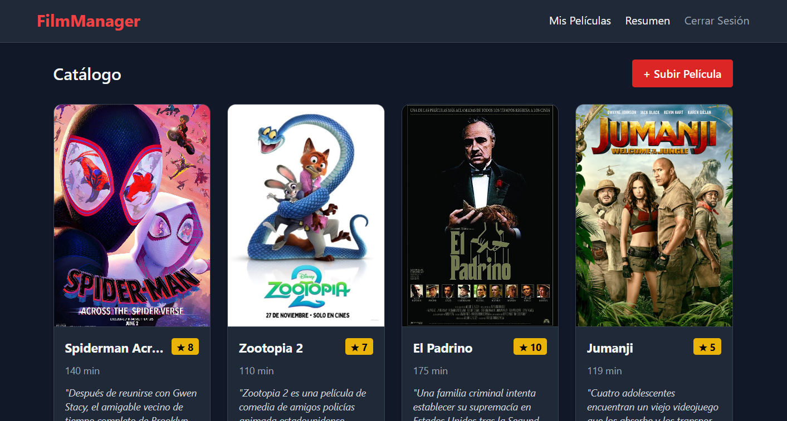
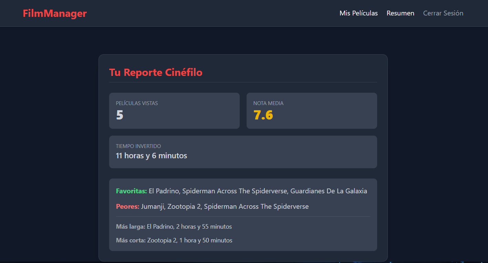

# FilmManager Frontend


**FilmManagerFrontend** es una Single Page Application (SPA) construida con HTML5 y JavaScript Vanilla. Utiliza **Tailwind CSS** a través de CDN para el estilizado y diseño responsivo.

El proyecto está diseñado para consumir una API RESTful configurada localmente en http://127.0.0.1:8000.


## 🖼️ Capturas
- ### Pagina Principal
   <p align="center">
      
   </p>


- ### Resumen
   <p align="center">
      
   </p>


## **1. Arquitectura de Vistas y Estado**

La aplicación maneja el estado de la interfaz ocultando y mostrando contenedores mediante la clase utilitaria hidden de Tailwind.

Vista de Autenticación (#auth-view): Formulario unificado para ingreso y registro de usuarios. Se gestiona internamente con la variable isLoginMode para alternar entre los endpoints de login y registro.

**Vista Principal (#main-view)**: Contiene la barra de navegación y bifurca en dos secciones principales:

**Catálogo (#movies-section)**: Grilla de películas cargadas.

**Resumen (#stats-section)**: Panel de estadísticas del usuario.

Modal de Edición/Creación (#modal-movie): Formulario flotante reutilizable tanto para crear como para actualizar entradas.

## **2. Autenticación y Seguridad**

La aplicación utiliza JWT (JSON Web Tokens) para la autorización.

* **Almacenamiento**: Los tokens (access_token y refresh_token) se guardan en el localStorage del navegador.

* **Interceptador de Peticiones (fetchWithAuth)**: Actúa como un middleware para todas las peticiones protegidas.

    * Inyecta el header Authorization: Bearer <token>.

    * Captura respuestas HTTP 401 (No autorizado) e intenta automáticamente refrescar el token contra el endpoint /token/refresh/.

    * Si el refresh token expira o falla, ejecuta un logout() forzado.

## **3. Mapa de Consumo de API**

El frontend requiere que el servidor responda a los siguientes endpoints para funcionar correctamente:

### Endpoints Públicos

* ```POST /token/```: Recibe credenciales (username, password) y devuelve tokens de acceso y refresco.

* ```POST /register/```: Crea un nuevo usuario y devuelve tokens con la misma estructura que el login.

* ```POST /token/refresh/```: Recibe el refresh_token y devuelve un nuevo access token.

### Endpoints Protegidos (Requieren JWT)

* ```GET /movie-list/```: Devuelve un array de objetos JSON con las películas del usuario. Los campos esperados son id, title, poster, calificacion, duration_minutes y descripcion.

* ```GET /resumen/```: Devuelve métricas calculadas. Los campos esperados son peliculas_vistas, nota_media, tiempo_invertido, top_mejores, top_peores, pelicula_mas_larga y pelicula_mas_corta. Si no hay películas, espera un HTTP 404.

* ```POST /subir/```: Crea un registro de película.

* ```PATCH /movie-edit/<id>/```: Actualiza de forma parcial o total los datos de una película existente.

## **4. Estructura de Datos (Payloads)**

Para la creación (POST) y edición (PATCH) de películas, el frontend envía un JSON con la siguiente estructura:

```json
{
  "title": "String",
  "poster": "String (URL)",
  "duration_minutes": "Integer",
  "calificacion": "Integer (1-10)",
  "descripcion": "String"
}
```